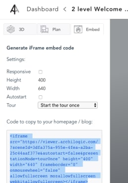

# Embedding a 3D View on your Website

In the 3D Viewer [Getting Started](3dviewer-gettingstarted.md) guide, we built a single page with a scene in it.  What if you'd like to embed the scene on an existing page?  This can be done with an iframe and the same url configuration, or with Javascript.  

##  Iframe Embedded Object

Using the same format as the url in the [Getting Started](3dviewer-gettingstarted.md) page, you can embed your scene onto an existing page.

In your [Dashboard](https://dashboard.archilogic.com/), simply select a scene, and then choose the "embed" option in the top left of the menu.  You'll see a number of options to help you build the embedded object.

| Setting | Description | 
| --- | --- | 
| Responsive | Should the scene change size based on the screen of the viewer? Sets a percentage of the screen to be used | 
| Height | Height of scene (in pixels) on the page | 
| Width  | Width of scene (in pixels) on the page |
| Tour   | How the tour will be played (see  [3dviewer-gettingstarted.md#presentation-mode-descriptions](Getting Started) ) |

These settings will generate a preview on the right, and the code to paste onto your page at the bottom left.

### Example Iframe Output

`<iframe src="https://viewer.archilogic.com/?sceneId=6d263da3-915a-47dd-8e41-7001a351ad7a&autostart=false&presentationMode=tourOnce" height="200" width="" frameborder="0" onmousewheel="false" allowfullscreen mozallowfullscreen webkitallowfullscreen></iframe>`

### Example Iframe View

<iframe src="https://viewer.archilogic.com/?sceneId=6d263da3-915a-47dd-8e41-7001a351ad7a&autostart=false&presentationMode=tourOnce" height="200" width="" frameborder="0" onmousewheel="false" allowfullscreen mozallowfullscreen webkitallowfullscreen></iframe>	

## Javascript

If you prefer more flexibility in how you scene is displayed on your site, you can use the 3DViewer Javascript to add further customization.  Read on to the next section to learn more.

[Customize views with Javascript](3dviewer-customize.md)

 