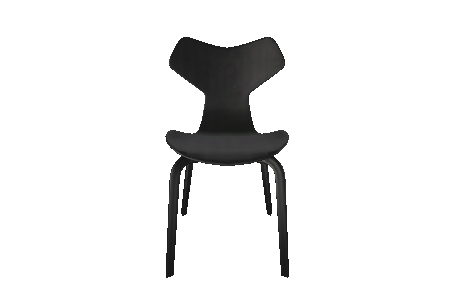

# A-Frame Components

## Overview

You've built the "Hello Wall" example, but now you're ready to do more!  Let's walk through the additional components and features you can add to your [A-Frame](https://aframe.io) model.  This document will walk through the components you can add to your model.

## Types
* [3D-object](#3d-object)
* [Camera-bookmark](#camera-bookmark)
* [Closet](#closet)
* [Column](#column)
* [Door](#door)
* [Floor](#floor)
* [Furniture](#furniture)
* [Kitchen](#kitchen)
* [Polyfloor](#polyfloor)
* [Railing](#railing)
* [Stairs](#stairs)
* [Wall](#wall)
* [Window](#window)


## 3D-object
This component is used to add an existing 3d object to your scene.  It must be in data3d.buffer format. (For conversion drop a .obj into the editor spaces.archilogic.com/3d).  For more details on adding an existing scene, see [Scenes and Lighting](aframe-scenes.html).

[Available parameters](scene-structure-reference.md#3d-object)

Example:
```html
<a-entity io3d-data3d="key: /3f995099-d624-4c8e-ab6b-1fd5e3799173/170515-0913-4p3ktf/1e588a3b-90ac-4a32-b5b8-ff2fda7f87c4.gz.data3d.buffer" position="0 0 0"></a-entity>
```

## Camera-bookmark
Used to add preset camera positions for animations and navigation.

[Available parameters](scene-structure-reference.md#camera-bookmark)

Example:
```html
<a-entity tour-waypoint="name: Camera Bookmark;" position="0 0 0"></a-entity>
```

## Closet
Storage for all the things you don't want everyone to see.


[Available parameters](scene-structure-reference.md#closet)

Example

```html
<a-entity io3d-closet="l: 1.8; h: 2.4; w: 0.6;" position="0 0 0"></a-entity>
```

## Column
simple structural column object, round or square


[Available parameters](scene-structure-reference.md#column)

Example
```html
<a-entity io3d-column="l: 0.2; h: 2.4; shape: square;" position="0 0 0"></a-entity>
```

## Door
Doors are typically placed as children of wall objects.  


[Available parameters](scene-structure-reference.md#door)

Example
```html
<a-entity io3d-door="l: 0.9; h: 2; w: 0.05; hinge: right; side: back; v: 3; threshold: true; doorType: singleSwing;" position="0 0 0"></a-entity>
```

## Floor
Rectangular floor. This attribute can add an optional ceiling to the area covered by the floor.


[Available parameters](scene-structure-reference.md#floor)

Example
```html
<a-entity io3d-floor="l: 4; h: 0.2; w: 4; hCeiling: 2.4; hasCeiling: true;" position="0 0 0"></a-entity>
```

## Furniture
Add furniture objects to the space.  The available furniture models can be found at [https://furniture.3d.io](https://furniture.3d.io/).



[Available parameters](scene-structure-reference.md#furniture)

A-Frame Component
```html
<a-entity io3d-furniture="id: 10344b13-d981-47a0-90ac-f048ee2780a6" position="0 0 0"></a-entity>
```

## Kitchen
A pre-constructed kitchen that fits along the wall.


[Available parameters](scene-structure-reference.md#kitchen)

Example
```html
<a-entity io3d-kitchen="l: 4.2; h: 2.4; w: 0.6; elementLength: 0.6;" position="0 0 0"></a-entity>
```

## Polyfloor
Polygonal floor with optional ceiling.

[Available parameters](scene-structure-reference.md#Polyfloor)

Example
```html
<a-entity io3d-polyfloor="h: 0.2; polygon: [[1.5,1.5], [1.5,-1.5], [-1.5,-1.5], [-1.5,1.5]]; hasCeiling: true; hCeiling: 2.4;" position="0 0 0"></a-entity>
```


## Railing
Segmented or solid railing.


[Available parameters](scene-structure-reference.md#Railing)

Example
```html
<a-entity io3d-railing="l: 1; h: 1; w: 0.05; pailing: 0.01; segmentation: distance;" position="0 0 0"></a-entity>
```


## Stairs
Access between levels of your home.


[Available parameters](scene-structure-reference.md#Stairs)

Example
```html
<a-entity io3d-stairs="l: 4; h: 2.4; w: 1.2; railingType: verticalBars; stepWidth: 1.2; stairType: straight; treadHeight: 0.02; stepThickness: 0.17; railing: right;" position="0 0 0"></a-entity>
```

## Wall
The basic building block of a scene, walls can contains doors and windows.


[Available parameters](scene-structure-reference.md#wall)

Example
```html
<a-entity io3d-wall="l: 1; h: 2.4; w: 0.15;" position="0 0 0"></a-entity>
```


## Window
Windows with possible segmentation.


[Available parameters](scene-structure-reference.md#window)

Example
```html
<a-entity io3d-window="l: 1.6; h: 1.5;" position="0 0.8 0"></a-entity>
```


