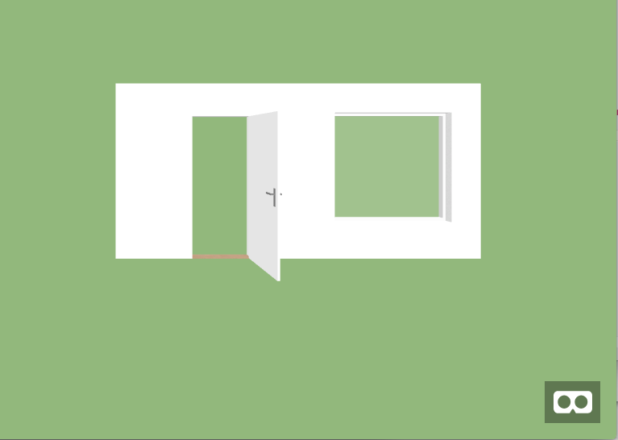
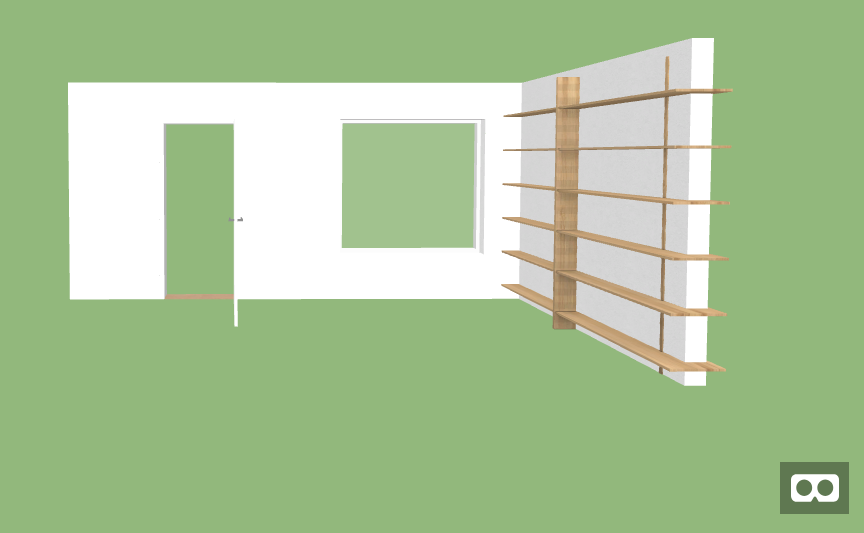

# Getting Started


## Hello Wall Example

Interested in building a 3D model in your browser?  Simply copy this code into hellowall.html, and load it in your favorite browser:

```html
<html>
<head>
  <script src="https://aframe.io/releases/0.7.1/aframe.min.js"></script>
  <script src="https://dist.3d.io/3dio-js/1.1.x/3dio.min.js"></script>
</head>
<body>
<style>
  body {
    background-color: #93B874;
  }
</style>
<a-scene>
  <a-entity io3d-wall position="0 0 -5"></a-entity>
</a-scene>
</body>
</html>
```

This html page loads the A-Frame and 3dio JavaScript, sets the background to green (so that we can see the white wall), and displays a 3dio wall segment using the default parameters.  If you load this page in a browser, you'll see a nice white wall.


You can pivot the view with your mouse, and navigate with the WASD keys of your keyboard. 

Of course, no model is complete by building a simple wall.  First, let's change the parameters of the wall: [todo add link to scene structure for wall]

```html
<a-entity io3d-wall="l: 5; h: 2.4; w: 0.15;"  position="0 0 -5"></a-entity>
```


Now the wall is 5 meters long, 2.4m high, and .15m thick.  We can add a window, by adding it as a child object to the wall:
```html
    <a-entity io3d-wall="l: 5; h: 2.4; w: 0.15;"  position="0 0 -5">
      <a-entity io3d-window="l: 1.6; h: 1.5;" position="3 0.5 0"></a-entity>
    </a-entity>
```
The window is 1.6mx1.5m, and begins 3m from the edge of the wall, at 0.5m height.  We can add additional child elements to the wall, like a door:

```html
  <a-entity io3d-wall="l: 5; h: 2.4; w: 0.15;"  position="0 0 -5">
      <a-entity io3d-window="l: 1.6; h: 1.5;" position="3 0.5 0"></a-entity>
      <a-entity io3d-door="l: 0.9; h: 2; w: 0.05; hinge: right; side: front; v: 3; threshold: true; doorType: singleSwing;" position="1 0 0"></a-entity> 
  </a-entity>
 
```


In addition to dimensions, the door has additional parameters like the direction the door opens (front), and if the hinge is on the left or right.

Building out a small room, we can add an additional wall and a bookshelf:
and a bookshelf:

```html 

<a-scene> 
  <a-entity io3d-wall="l: 5; h: 2.4; w: 0.15;"  position="0 0 -5">
      <a-entity io3d-window="l: 1.6; h: 1.5;" position="3 0.5 0"></a-entity>
      <a-entity io3d-door="l: 0.9; h: 2; w: 0.05; hinge: right; side: front; v: 3; threshold: true; doorType: singleSwing;" position="1 0 0"></a-entity> 
  </a-entity>
  <a-entity io3d-wall="l: 2; h: 2.4; w: 0.15;"  rotation="0 90 0" position="5 0 -3"></a-entity>
  <a-entity io3d-furniture="id: 10344b13-d981-47a0-90ac-f048ee2780a6" rotation="0 90 0" position="5 0 -4 "></a-entity>
</a-scene>

```



This inserts a 2nd wall at the edge of the first wall. The 90 degree rotation around the y axis gives us the clean right angle we are looking for.

We then place the bookself on the 2nd wall.  We set Z=-4 to center it on the wall.


Use the A-Frame components and [Furniture Library](https://furniture.3d.io/) to add more items to the example! [To Do, Add links to the components When page is built]


## Next Steps
* [A-Frame Scenes and Components](aframe-components.md)
* [A-Frame Lighting](aframe-lighting.md)
* [A-Frame Camera](
