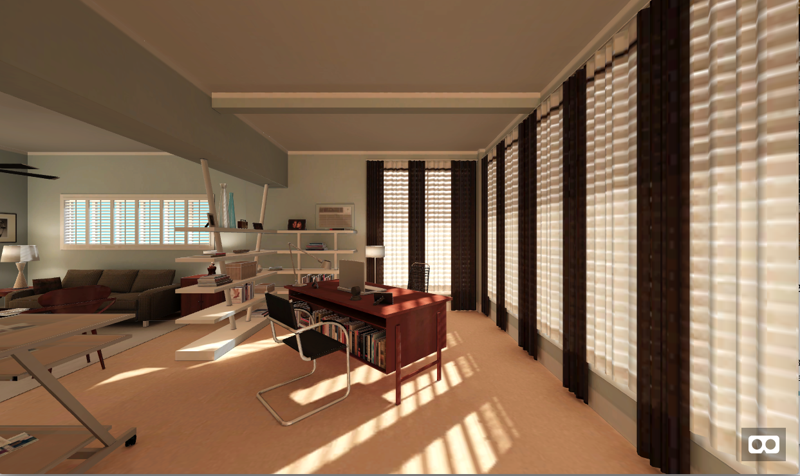

## Adding a Scene to your A-Frame Model


If you have a scene created with 3dio, you can open it with A-Frame by using its url or key. 

| Parameter | Description |
| --- | --- |
| key | Specifies a 3d.io [storage key](storage.md) to identify 3d data to display, e.g. /3f995099-d624-4c8e-ab6b-1fd5e3799173/170515-0913-4p3ktf/1e588a3b-90ac-4a32-b5b8-ff2fda7f87c4.gz.data3d.buffer |
| url | Specifies a URL of a .data3d.json or .data3d.buffer file, e.g. https://storage.3d.io/3f995099-d624-4c8e-ab6b-1fd5e3799173/170515-0913-4p3ktf/1e588a3b-90ac-4a32-b5b8-ff2fda7f87c4.gz.data3d.buffer |
| lightMapIntensity | Intensity (default 1.2) of the lightmap being applied |
| lightMapExposure | Exposure (default 0.6) of the lightmap being applied |


Here are a few example keys that you can experiment with:

| Key | 
| --- |
| /fd72bf39-9d3a-471f-a4ff-ecaa3f5ff30b/bake/2017-04-15_22-45-14_XsiltX/regular/lighting.gz.data3d.buffer |
| /3f995099-d624-4c8e-ab6b-1fd5e3799173/170515-0913-4p3ktf/1e588a3b-90ac-4a32-b5b8-ff2fda7f87c4.gz.data3d.buffer |
| /3f995099-d624-4c8e-ab6b-1fd5e3799173/170515-0913-4p3ktf/1e588a3b-90ac-4a32-b5b8-ff2fda7f87c4.gz.data3d.buffer |

### Loading the 3dio Model

Building a page with a scene completed using the ```io3d-data3d``` entity.  For example, this page loads one of the scenes listed in the above table:

```html
<head>
  <script src="https://aframe.io/releases/0.7.1/aframe.min.js"></script>
  <script src="https://dist.3d.io/3dio-js/1.1.x/3dio.min.js"></script>
</head>
<body>
  <a-scene>
    <!-- data3d files specified by 3d.io storage 'key:' or 'url:' -->
    <a-entity io3d-data3d="url:https://storage.3d.io/3f995099-d624-4c8e-ab6b-1fd5e3799173/170515-0913-4p3ktf/1e588a3b-90ac-4a32-b5b8-ff2fda7f87c4.gz.data3d.buffer"  rotation = "0 -90 0" position="-2 0 0"></a-entity>

  </a-scene>
</body>
```

In your browser, you'll see the following:


[Interactive demo](https://3dio-aframe.glitch.me/)


## Changing the lighting

Lighting can be configured using two properties: `lightMapIntensity` and `lightMapExposure`.

Both influence how the [precalculated lights](https://spaces.archilogic.com/blog/3d-models-light-baking) are affecting the loaded scene.
The exposure can be used to over- or underexpose the scene while the intensity allows to adjust how much the light blends with the materials.

The relation of the two settings is visualised below:


## Lighting your Scene

Using `io3d-lighting` component replaces the default A-Frame lighting scene and adds new preset

| Parameter | Description | Default value |
| --- | --- | --- |
| `preset` | Choose from different presets (currently only `studio` is available) | `studio` |
| `intensity` | Intensity multiplier. | `1` |
| `saturation` | Saturation multiplier. | `1` |

### Usage:

```html
<a-scene io3d-lighting>
</a-scene>
```

### Comparison

* A-Frame default lighting

* Studio preset


## gblock

Loads Google Blocks glTFs models hosted on [https://vr.google.com/blocks](https://vr.google.com/blocks). The only parameter is the URL of a specific google blocks model.

### Example
```html
<a-scene>
  <a-entity gblock="https://vr.google.com/objects/duKsqcc0oUX"></a-entity>
</a-scene>
```