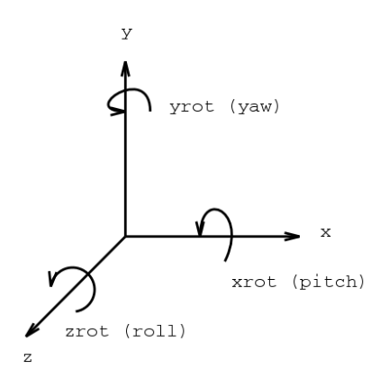
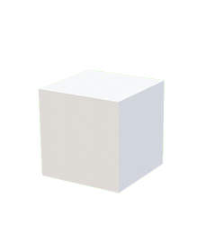
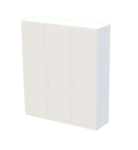
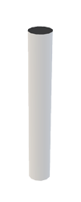
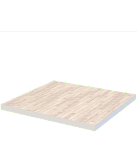
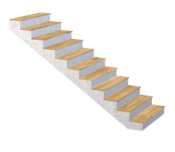

<!-- sceneStructure reference created automatically -->
<!-- do not edit manually -->
<!-- check ./tasks/scene-structure-reference/README.md -->
# Scene Structure Specifications

Main data format of every Archilogic 3D scene.<br>
Describes all elements of a scene including their relations to each other (location, orientation, hierarchy) and their specific characteristics (attributes).

SceneStructure can be converted from and to A-Frame components on the fly

[sceneStructure to A-Frame Elements](scene.md#get-a-frame-elements-from-scene-structure)

[A-Frame Elements to sceneStructure](scene.md#get-scene-structure-from-a-frame-elements)

## Coordinate System



Type: right-handed cartesian coordinate system<br>
Units: meters, degree angles<br>
Origin: always relative to parent element<br>
Y orientation: E=0° N=90° W=180° S=270°
## Types
* [box](#box)
* [camera-bookmark](#camera-bookmark)
* [closet](#closet)
* [column](#column)
* [curtain](#curtain)
* [door](#door)
* [floor](#floor)
* [floorplan](#floorplan)
* [group](#group)
* [interior](#interior)
* [kitchen](#kitchen)
* [level](#level)
* [object](#object)
* [plan](#plan)
* [polybox](#polybox)
* [polyfloor](#polyfloor)
* [railing](#railing)
* [stairs](#stairs)
* [tag](#tag)
* [wall](#wall)
* [window](#window)


## box
simple box object



| param | description | type | default | optional | min | values |
|---|---|---|---|---|---|---|
| type |  | string | "box" | false |  | "box" |
| x |  | number | 0 | false |  |  |
| y |  | number | 0 | false |  |  |
| z |  | number | 0 | false |  |  |
| ry | rotation around y axis | number | 0 | false |  |  |
| l | length | number | 1 | false | 0.01 |  |
| h | height | number | 1 | false | 0.01 |  |
| w | width | number | 1 | false | 0.01 |  |
| v | version | number | 0 | true |  |  |
| id | unique identifier: UUID v4 | string |  | false |  |  |
| materials |  | object |  | true |  |  |

Possible parent types
* [`level`](#level)

SceneStructure Json
```json
{
  "type": "box",
  "x": 0,
  "y": 0,
  "z": 0,
  "ry": 0,
  "l": 1,
  "h": 1,
  "w": 1,
  "id": ""
}```

A-Frame Component
```html
<a-entity io3d-box="l: 1; h: 1; w: 1;" position="0 0 0"></a-entity>
```


## camera-bookmark
preset camera positions for animations and navigation

| param | description | type | default | optional | min | values |
|---|---|---|---|---|---|---|
| `type` |  | `string` | `"camera-bookmark"` | `false` |  | `"camera-bookmark"` |
| `x` |  | `number` | `0` | `false` |  |  |
| `y` |  | `number` | `0` | `false` |  |  |
| `z` |  | `number` | `0` | `false` |  |  |
| `ry` | rotation around y axis | `number` | `0` | `false` |  |  |
| `v` | version | `number` | `0` | `true` |  |  |
| `rx` | pitch | `number` | `0` | `false` |  |  |
| `distance` |  | `number` |  | `false` |  |  |
| `fov` |  | `number` | `71` | `false` |  |  |
| `name` |  | `string` | `"Camera Bookmark"` | `false` |  |  |
| `id` | unique identifier: UUID v4 | `string` |  | `false` |  |  |
| `materials` |  | `object` |  | `true` |  |  |

Possible parent types
* [`plan`](#plan)

SceneStructure Json
```json
{
  "type": "camera-bookmark",
  "x": 0,
  "y": 0,
  "z": 0,
  "ry": 0,
  "rx": 0,
  "distance": "",
  "fov": 71,
  "name": "Camera Bookmark",
  "id": ""
}```

A-Frame Component
```html
<a-entity tour-waypoint="name: Camera Bookmark;" position="0 0 0"></a-entity>
```


## closet
parametric closet with segmentation targeting 0.6m



| param | description | type | default | optional | min | values |
|---|---|---|---|---|---|---|
| `type` |  | `string` | `"closet"` | `false` |  | `"closet"` |
| `x` |  | `number` | `0` | `false` |  |  |
| `y` |  | `number` | `0` | `false` |  |  |
| `z` |  | `number` | `0` | `false` |  |  |
| `ry` | rotation around y axis | `number` | `0` | `false` |  |  |
| `l` | length | `number` | `1.8` | `false` | `0.01` |  |
| `h` | height | `number` | `2.4` | `false` | `0.01` |  |
| `w` | width | `number` | `0.6` | `false` | `0.01` |  |
| `handleHeight` | height of closet door handle | `number` | `0.3` | `true` | `0.01` |  |
| `baseboard` | height of baseboard | `number` | `0.1` | `true` | `0.01` |  |
| `doorWidth` | thickness of closet door | `number` | `0.02` | `true` | `0.01` |  |
| `handleLength` | length of closet door handle | `number` | `0.02` | `true` | `0.01` |  |
| `handleWidth` | thickness of closet door handle | `number` | `0.02` | `true` | `0.01` |  |
| `v` | version | `number` | `1` | `true` |  |  |
| `id` | unique identifier: UUID v4 | `string` |  | `false` |  |  |
| `materials` |  | `object` |  | `true` |  |  |

Possible parent types
* [`level`](#level)

SceneStructure Json
```json
{
  "type": "closet",
  "x": 0,
  "y": 0,
  "z": 0,
  "ry": 0,
  "l": 1.8,
  "h": 2.4,
  "w": 0.6,
  "id": ""
}```

A-Frame Component
```html
<a-entity io3d-closet="l: 1.8; h: 2.4; w: 0.6;" position="0 0 0"></a-entity>
```


## column
simple structural column object, round or square



| param | description | type | default | optional | min | values |
|---|---|---|---|---|---|---|
| `type` |  | `string` | `"column"` | `false` |  | `"column"` |
| `x` |  | `number` | `0` | `false` |  |  |
| `y` |  | `number` | `0` | `false` |  |  |
| `z` |  | `number` | `0` | `false` |  |  |
| `ry` | rotation around y axis | `number` | `0` | `false` |  |  |
| `l` | length for square / diameter for circle | `number` | `0.2` | `false` | `0.01` |  |
| `h` | height | `number` | `2.4` | `false` | `0.01` |  |
| `shape` | column contour | `string` | `"square"` | `false` | `0.01` | `"square"` `"circle"` |
| `v` | version | `number` | `1` | `true` |  |  |
| `id` | unique identifier: UUID v4 | `string` |  | `false` |  |  |
| `materials` |  | `object` |  | `true` |  |  |

Possible parent types
* [`level`](#level)
* [`group`](#group)

SceneStructure Json
```json
{
  "type": "column",
  "x": 0,
  "y": 0,
  "z": 0,
  "ry": 0,
  "l": 0.2,
  "h": 2.4,
  "shape": "square",
  "id": ""
}```

A-Frame Component
```html
<a-entity io3d-column="l: 0.2; h: 2.4; shape: square;" position="0 0 0"></a-entity>
```


## curtain
curtain with random folds


| param | description | type | default | optional | min | values |
|---|---|---|---|---|---|---|
| `type` |  | `string` | `"curtain"` | `false` |  | `"curtain"` |
| `x` |  | `number` | `0` | `false` |  |  |
| `y` |  | `number` | `0` | `false` |  |  |
| `z` |  | `number` | `0` | `false` |  |  |
| `ry` | rotation around y axis | `number` | `0` | `false` |  |  |
| `l` | length | `number` | `1.8` | `false` | `0.01` |  |
| `h` | height | `number` | `2.4` | `false` | `0.01` |  |
| `w` | thickness | `number` | `0.2` | `false` | `0.01` |  |
| `folds` | number of folds | `number` | `14` | `true` | `0.01` |  |
| `v` | version | `number` | `1` | `true` |  |  |
| `id` | unique identifier: UUID v4 | `string` |  | `false` |  |  |
| `materials` |  | `object` |  | `true` |  |  |

Possible parent types
* [`level`](#level)

SceneStructure Json
```json
{
  "type": "curtain",
  "x": 0,
  "y": 0,
  "z": 0,
  "ry": 0,
  "l": 1.8,
  "h": 2.4,
  "w": 0.2,
  "id": ""
}```

## door
door within a wall


| param | description | type | default | optional | min | values |
|---|---|---|---|---|---|---|
| `type` |  | `string` | `"door"` | `false` |  | `"door"` |
| `x` |  | `number` | `0` | `false` |  |  |
| `y` |  | `number` | `0` | `false` |  |  |
| `z` |  | `number` | `0` | `false` |  |  |
| `ry` | rotation around y axis | `number` | `0` | `false` |  |  |
| `l` | length | `number` | `0.9` | `false` | `0.01` |  |
| `h` | height | `number` | `2` | `false` | `0.01` |  |
| `w` | width | `number` | `0.05` | `false` | `0.01` |  |
| `doorAngle` | door leaf opening anlge | `number` | `92` | `true` |  |  |
| `hinge` | door leaf opening direction | `string` | `"right"` | `false` |  | `"right"` `"left"` |
| `side` | door leaf opening to the front or back of the wall | `string` | `"back"` | `false` |  | `"front"` `"back"` |
| `v` | version | `number` | `3` | `false` |  |  |
| `fixLeafRatio` |  | `number` | `0.3` | `true` |  |  |
| `threshold` |  | `boolean` | `true` | `false` |  |  |
| `thresholdHeight` |  | `number` | `0.01` | `true` |  |  |
| `frameLength` | thickness of frame | `number` | `0.05` | `true` | `0.01` |  |
| `frameOffset` | frame thicker than wall | `number` | `0` | `true` |  |  |
| `leafWidth` | thickness of door leaf | `number` | `0.03` | `true` |  |  |
| `leafOffset` | z offset of door leaf | `number` | `0.005` | `true` |  |  |
| `doorType` | defines opening type | `string` | `"singleSwing"` | `false` |  | `"singleSwing"` `"doubleSwing"` `"swingFix"` `"swingDoubleFix"` `"doubleSwingDoubleFix"` `"slidingDoor"` `"opening"` |
| `id` | unique identifier: UUID v4 | `string` |  | `false` |  |  |
| `materials` |  | `object` |  | `true` |  |  |

Possible parent types
* [`wall`](#wall)

SceneStructure Json
```json
{
  "type": "door",
  "x": 0,
  "y": 0,
  "z": 0,
  "ry": 0,
  "l": 0.9,
  "h": 2,
  "w": 0.05,
  "hinge": "right",
  "side": "back",
  "v": 3,
  "threshold": true,
  "doorType": "singleSwing",
  "id": ""
}```

A-Frame Component
```html
<a-entity io3d-door="l: 0.9; h: 2; w: 0.05; hinge: right; side: back; v: 3; threshold: true; doorType: singleSwing;" position="0 0 0"></a-entity>
```


## floor
rectangular floor with optional ceiling



| param | description | type | default | optional | min | values |
|---|---|---|---|---|---|---|
| `type` |  | `string` | `"floor"` | `false` |  | `"floor"` |
| `x` |  | `number` | `0` | `false` |  |  |
| `y` |  | `number` | `0` | `false` |  |  |
| `z` |  | `number` | `0` | `false` |  |  |
| `ry` | rotation around y axis | `number` | `0` | `false` |  |  |
| `l` | length | `number` | `4` | `false` | `0.01` |  |
| `h` | height | `number` | `0.2` | `false` | `0.01` |  |
| `w` | width | `number` | `4` | `false` | `0.01` |  |
| `hCeiling` | ceiling height | `number` | `2.4` | `false` |  |  |
| `v` | version | `number` | `0` | `true` |  |  |
| `hasCeiling` | toggle ceiling | `boolean` | `true` | `false` |  |  |
| `id` | unique identifier: UUID v4 | `string` |  | `false` |  |  |
| `materials` |  | `object` |  | `true` |  |  |

Possible parent types
* [`level`](#level)

SceneStructure Json
```json
{
  "type": "floor",
  "x": 0,
  "y": 0,
  "z": 0,
  "ry": 0,
  "l": 4,
  "h": 0.2,
  "w": 4,
  "hCeiling": 2.4,
  "hasCeiling": true,
  "id": ""
}```

A-Frame Component
```html
<a-entity io3d-floor="l: 4; h: 0.2; w: 4; hCeiling: 2.4; hasCeiling: true;" position="0 0 0"></a-entity>
```


## floorplan
reference to a floor plan image

| param | description | type | default | optional | min | values |
|---|---|---|---|---|---|---|
| `type` |  | `string` | `"floorplan"` | `false` |  | `"floorplan"` |
| `x` |  | `number` | `0` | `false` |  |  |
| `y` |  | `number` | `0` | `false` |  |  |
| `z` |  | `number` | `0` | `false` |  |  |
| `ry` | rotation around y axis | `number` | `0` | `false` |  |  |
| `l` |  | `number` |  | `false` | `0.01` |  |
| `w` |  | `number` |  | `false` | `0.01` |  |
| `file` |  | `string` |  | `false` |  |  |
| `v` | version | `number` | `0` | `true` |  |  |
| `id` | unique identifier: UUID v4 | `string` |  | `false` |  |  |
| `materials` |  | `object` |  | `true` |  |  |

Possible parent types
* [`level`](#level)

SceneStructure Json
```json
{
  "type": "floorplan",
  "x": 0,
  "y": 0,
  "z": 0,
  "ry": 0,
  "l": "",
  "w": "",
  "file": "",
  "id": ""
}```

## group
group node, for relative positioning

| param | description | type | default | optional | min | values |
|---|---|---|---|---|---|---|
| `type` |  | `string` | `"group"` | `false` |  | `"group"` |
| `x` |  | `number` | `0` | `false` |  |  |
| `y` |  | `number` | `0` | `false` |  |  |
| `z` |  | `number` | `0` | `false` |  |  |
| `ry` | rotation around y axis | `number` | `0` | `false` |  |  |
| `src` |  | `string` |  | `true` |  |  |
| `children` |  | `array` | `[]` | `true` |  |  |
| `id` | unique identifier: UUID v4 | `string` |  | `false` |  |  |
| `materials` |  | `object` |  | `true` |  |  |

Possible parent types
* [`level`](#level)
* [`group`](#group)

Possible children types
* [`box`](#box)
* [`column`](#column)
* [`group`](#group)
* [`interior`](#interior)
* [`object`](#object)
* [`polybox`](#polybox)
* [`wall`](#wall)

SceneStructure Json
```json
{
  "type": "group",
  "x": 0,
  "y": 0,
  "z": 0,
  "ry": 0,
  "id": ""
}```

## interior


| param | description | type | default | optional | min | values |
|---|---|---|---|---|---|---|
| `type` |  | `string` | `"interior"` | `false` |  | `"interior"` |
| `x` |  | `number` | `0` | `false` |  |  |
| `y` |  | `number` | `0` | `false` |  |  |
| `z` |  | `number` | `0` | `false` |  |  |
| `ry` | rotation around y axis | `number` | `0` | `false` |  |  |
| `src` | furniture id prefixed with '!', check https://furniture.3d.io | `string` |  | `false` |  |  |
| `children` |  | `array` | `[]` | `true` |  |  |
| `id` | unique identifier: UUID v4 | `string` |  | `false` |  |  |
| `materials` |  | `object` |  | `true` |  |  |

Possible parent types
* [`level`](#level)
* [`group`](#group)
* [`interior`](#interior)

Possible children types
* [`interior`](#interior)
* [`object`](#object)
* [`tag`](#tag)

SceneStructure Json
```json
{
  "type": "interior",
  "x": 0,
  "y": 0,
  "z": 0,
  "ry": 0,
  "src": "",
  "id": ""
}```

A-Frame Component
```html
<a-entity io3d-furniture="id: 10344b13-d981-47a0-90ac-f048ee2780a6" position="0 0 0"></a-entity>
```


## kitchen
parametric kitchen with vast configuration options


| param | description | type | default | optional | min | values |
|---|---|---|---|---|---|---|
| `type` |  | `string` | `"kitchen"` | `false` |  | `"kitchen"` |
| `x` |  | `number` | `0` | `false` |  |  |
| `y` |  | `number` | `0` | `false` |  |  |
| `z` |  | `number` | `0` | `false` |  |  |
| `ry` | rotation around y axis | `number` | `0` | `false` |  |  |
| `l` |  | `number` | `4.2` | `false` | `0.01` |  |
| `h` |  | `number` | `2.4` | `false` | `0.01` |  |
| `w` |  | `number` | `0.6` | `false` | `0.01` |  |
| `sinkPos` |  | `int` | `4` | `true` |  |  |
| `doorWidth` |  | `number` | `0.02` | `true` | `0.01` |  |
| `highCabinetLeft` |  | `int` | `2` | `true` |  |  |
| `highCabinetRight` |  | `int` | `0` | `true` |  |  |
| `wallCabinet` |  | `boolean` | `true` | `true` |  |  |
| `wallCabinetHeight` |  | `number` | `1.5` | `true` | `0.01` |  |
| `wallCabinetWidth` |  | `number` | `0.45` | `true` | `0.01` |  |
| `cabinetType` |  | `string` | `"flat"` | `true` |  | `"flat"` `"style1"` `"style2"` |
| `sinkType` |  | `string` | `"single"` | `true` |  | `"single"` `"double"` `"none"` |
| `v` | version | `number` | `2` | `true` |  |  |
| `extractorType` |  | `string` | `"integrated"` | `true` |  | `"box"` `"pyramid"` `"integrated"` `"none"` |
| `ovenType` |  | `string` | `"single"` | `true` |  | `"single"` `"double"` `"none"` |
| `ovenPos` |  | `int` | `6` | `true` |  |  |
| `cooktopType` |  | `string` | `"electro60"` | `true` |  | `"electro60"` `"electro90"` `"gas60"` `"gas90"` `"none"` |
| `cooktopPos` |  | `int` | `6` | `true` |  |  |
| `microwave` |  | `boolean` | `false` | `true` |  |  |
| `microwavePos` |  | `int` | `1` | `true` |  |  |
| `fridge` |  | `boolean` | `false` | `true` |  |  |
| `fridgePos` |  | `int` | `1` | `true` |  |  |
| `elementLength` |  | `number` | `0.6` | `false` | `0.01` |  |
| `baseBoard` |  | `number` | `0.1` | `true` | `0.01` |  |
| `counterHeight` |  | `number` | `0.9` | `true` | `0.01` |  |
| `counterThickness` |  | `number` | `0.03` | `true` | `0.01` |  |
| `barCounter` |  | `boolean` | `false` | `true` |  |  |
| `id` | unique identifier: UUID v4 | `string` |  | `false` |  |  |
| `materials` |  | `object` |  | `true` |  |  |

Possible parent types
* [`level`](#level)

SceneStructure Json
```json
{
  "type": "kitchen",
  "x": 0,
  "y": 0,
  "z": 0,
  "ry": 0,
  "l": 4.2,
  "h": 2.4,
  "w": 0.6,
  "elementLength": 0.6,
  "id": ""
}```

A-Frame Component
```html
<a-entity io3d-kitchen="l: 4.2; h: 2.4; w: 0.6; elementLength: 0.6;" position="0 0 0"></a-entity>
```


## level
node equivalent to a building storey

| param | description | type | default | optional | min | values |
|---|---|---|---|---|---|---|
| `type` |  | `string` | `"level"` | `false` |  | `"level"` |
| `x` |  | `number` | `0` | `false` |  |  |
| `y` |  | `number` | `0` | `false` |  |  |
| `z` |  | `number` | `0` | `false` |  |  |
| `ry` | rotation around y axis | `number` | `0` | `false` |  |  |
| `children` |  | `array` | `[]` | `true` |  |  |
| `id` | unique identifier: UUID v4 | `string` |  | `false` |  |  |
| `materials` |  | `object` |  | `true` |  |  |

Possible parent types
* [`plan`](#plan)

Possible children types
* [`box`](#box)
* [`closet`](#closet)
* [`column`](#column)
* [`curtain`](#curtain)
* [`floor`](#floor)
* [`floorplan`](#floorplan)
* [`group`](#group)
* [`interior`](#interior)
* [`kitchen`](#kitchen)
* [`object`](#object)
* [`polybox`](#polybox)
* [`polyfloor`](#polyfloor)
* [`railing`](#railing)
* [`stairs`](#stairs)
* [`tag`](#tag)
* [`wall`](#wall)

SceneStructure Json
```json
{
  "type": "level",
  "x": 0,
  "y": 0,
  "z": 0,
  "ry": 0,
  "id": ""
}```

## object
referenced 3d object in data3d.buffer format, for conversion drop a .obj into the editor spaces.archilogic.com/3d

| param | description | type | default | optional | min | values |
|---|---|---|---|---|---|---|
| `type` |  | `string` | `"object"` | `false` |  | `"object"` |
| `x` |  | `number` | `0` | `false` |  |  |
| `y` |  | `number` | `0` | `false` |  |  |
| `z` |  | `number` | `0` | `false` |  |  |
| `ry` | rotation around y axis | `number` | `0` | `false` |  |  |
| `sourceScale` | relative scale of source file to 1 meter | `number` |  | `true` |  |  |
| `object` | reference to data3d.buffer file | `string` |  | `false` |  |  |
| `flipYZ` | flip Y and Z Axis | `boolean` |  | `true` |  |  |
| `children` |  | `array` | `[]` | `true` |  |  |
| `id` | unique identifier: UUID v4 | `string` |  | `false` |  |  |
| `materials` |  | `object` |  | `true` |  |  |

Possible parent types
* [`level`](#level)

Possible children types
* [`interior`](#interior)

SceneStructure Json
```json
{
  "type": "object",
  "x": 0,
  "y": 0,
  "z": 0,
  "ry": 0,
  "object": "",
  "id": ""
}```

A-Frame Component
```html
<a-entity io3d-data3d="key: /3f995099-d624-4c8e-ab6b-1fd5e3799173/170515-0913-4p3ktf/1e588a3b-90ac-4a32-b5b8-ff2fda7f87c4.gz.data3d.buffer" position="0 0 0"></a-entity>
```


## plan
highest node in hierarchy, contains levels

| param | description | type | default | optional | min | values |
|---|---|---|---|---|---|---|
| `type` |  | `string` | `"plan"` | `false` |  | `"plan"` |
| `x` |  | `number` | `0` | `false` |  |  |
| `y` |  | `number` | `0` | `false` |  |  |
| `z` |  | `number` | `0` | `false` |  |  |
| `ry` | rotation around y axis | `number` | `0` | `false` |  |  |
| `modelDisplayName` | name of the scene | `string` |  | `true` |  |  |
| `v` | version | `number` | `1` | `true` |  |  |
| `children` |  | `array` | `[]` | `true` |  |  |
| `id` | unique identifier: UUID v4 | `string` |  | `false` |  |  |
| `materials` |  | `object` |  | `true` |  |  |

Possible children types
* [`level`](#level)
* [`camera-bookmark`](#camera-bookmark)

SceneStructure Json
```json
{
  "type": "plan",
  "x": 0,
  "y": 0,
  "z": 0,
  "ry": 0,
  "id": ""
}```

## polybox
polygonal extrusion object


| param | description | type | default | optional | min | values |
|---|---|---|---|---|---|---|
| `type` |  | `string` | `"polybox"` | `false` |  | `"polybox"` |
| `x` |  | `number` | `0` | `false` |  |  |
| `y` |  | `number` | `0` | `false` |  |  |
| `z` |  | `number` | `0` | `false` |  |  |
| `ry` | rotation around y axis | `number` | `0` | `false` |  |  |
| `h` |  | `number` | `1` | `false` | `0.01` |  |
| `polygon` |  | `array` |  | `false` |  |  |
| `v` | version | `number` | `1` | `true` |  |  |
| `id` | unique identifier: UUID v4 | `string` |  | `false` |  |  |
| `materials` |  | `object` |  | `true` |  |  |

Possible parent types
* [`level`](#level)

SceneStructure Json
```json
{
  "type": "polybox",
  "x": 0,
  "y": 0,
  "z": 0,
  "ry": 0,
  "h": 1,
  "polygon": "",
  "id": ""
}```

A-Frame Component
```html
<a-entity io3d-polybox="h: 1; polygon: undefined;" position="0 0 0"></a-entity>
```


## polyfloor
polygonal floor with optional ceiling


| param | description | type | default | optional | min | values |
|---|---|---|---|---|---|---|
| `type` |  | `string` | `"polyfloor"` | `false` |  | `"polyfloor"` |
| `x` |  | `number` | `0` | `false` |  |  |
| `y` |  | `number` | `0` | `false` |  |  |
| `z` |  | `number` | `0` | `false` |  |  |
| `ry` | rotation around y axis | `number` | `0` | `false` |  |  |
| `h` | height | `number` | `0.2` | `false` | `0.01` |  |
| `usage` |  | `string` |  | `true` |  |  |
| `v` | version | `number` | `0` | `true` |  |  |
| `polygon` | outer polygon | `array` | `[[1.5,1.5],[1.5,-1.5],[-1.5,-1.5],[-1.5,1.5]]` | `false` |  |  |
| `polygonHoles` | polygon holes | `array` |  | `true` |  |  |
| `hasCeiling` | toggle ceiling | `boolean` | `true` | `false` |  |  |
| `hCeiling` | ceiling height | `number` | `2.4` | `false` |  |  |
| `id` | unique identifier: UUID v4 | `string` |  | `false` |  |  |
| `materials` |  | `object` |  | `true` |  |  |

Possible parent types
* [`level`](#level)

SceneStructure Json
```json
{
  "type": "polyfloor",
  "x": 0,
  "y": 0,
  "z": 0,
  "ry": 0,
  "h": 0.2,
  "polygon": [[1.5,1.5],[1.5,-1.5],[-1.5,-1.5],[-1.5,1.5]],
  "hasCeiling": true,
  "hCeiling": 2.4,
  "id": ""
}```

A-Frame Component
```html
<a-entity io3d-polyfloor="h: 0.2; polygon: [[1.5,1.5], [1.5,-1.5], [-1.5,-1.5], [-1.5,1.5]]; hasCeiling: true; hCeiling: 2.4;" position="0 0 0"></a-entity>
```


## railing
segmented or solid railing


| param | description | type | default | optional | min | values |
|---|---|---|---|---|---|---|
| `type` |  | `string` | `"railing"` | `false` |  | `"railing"` |
| `x` |  | `number` | `0` | `false` |  |  |
| `y` |  | `number` | `0` | `false` |  |  |
| `z` |  | `number` | `0` | `false` |  |  |
| `ry` | rotation around y axis | `number` | `0` | `false` |  |  |
| `l` | length | `number` | `1` | `false` | `0.01` |  |
| `h` | height | `number` | `1` | `false` | `0.01` |  |
| `w` | width | `number` | `0.05` | `false` | `0.01` |  |
| `segmentDistance` | distance between vertical segments, for segmentation = 'distance' | `number` | `0.14` | `true` |  |  |
| `pailing` | strength of the posts | `number` | `0.01` | `false` |  |  |
| `railCount` | horizontal rail count | `int` | `2` | `true` |  |  |
| `segmentation` | vertical segmentation type | `string` | `"distance"` | `false` |  | `"distance"` `"number"` `"none"` |
| `segments` | number of vertical segments, for segmentation = 'number' | `int` | `5` | `true` |  |  |
| `v` | version | `number` | `0` | `true` |  |  |
| `id` | unique identifier: UUID v4 | `string` |  | `false` |  |  |
| `materials` |  | `object` |  | `true` |  |  |

Possible parent types
* [`level`](#level)

SceneStructure Json
```json
{
  "type": "railing",
  "x": 0,
  "y": 0,
  "z": 0,
  "ry": 0,
  "l": 1,
  "h": 1,
  "w": 0.05,
  "pailing": 0.01,
  "segmentation": "distance",
  "id": ""
}```

A-Frame Component
```html
<a-entity io3d-railing="l: 1; h: 1; w: 0.05; pailing: 0.01; segmentation: distance;" position="0 0 0"></a-entity>
```


## stairs
all kinds of stairs types



| param | description | type | default | optional | min | values |
|---|---|---|---|---|---|---|
| `type` |  | `string` | `"stairs"` | `false` |  | `"stairs"` |
| `x` |  | `number` | `0` | `false` |  |  |
| `y` |  | `number` | `0` | `false` |  |  |
| `z` |  | `number` | `0` | `false` |  |  |
| `ry` | rotation around y axis | `number` | `0` | `false` |  |  |
| `l` |  | `number` | `4` | `false` | `0.01` |  |
| `h` |  | `number` | `2.4` | `false` | `0.01` |  |
| `w` |  | `number` | `1.2` | `false` | `0.01` |  |
| `railingType` |  | `string` | `"verticalBars"` | `false` |  | `"verticalBars"` |
| `v` | version | `number` | `1` | `true` |  |  |
| `stepWidth` |  | `number` | `1.2` | `false` | `0.01` |  |
| `stairType` |  | `string` | `"straight"` | `false` |  | `"straight"` `"straightLanding"` `"lShaped"` `"halfLanding"` `"2QuarterLanding"` `"winder"` `"doubleWinder"` `"spiral"` |
| `treadHeight` |  | `number` | `0.02` | `false` |  |  |
| `stepThickness` |  | `number` | `0.17` | `false` |  |  |
| `railing` |  | `string` | `"right"` | `false` |  | `"none"` `"left"` `"right"` `"both"` |
| `id` | unique identifier: UUID v4 | `string` |  | `false` |  |  |
| `materials` |  | `object` |  | `true` |  |  |

Possible parent types
* [`level`](#level)

SceneStructure Json
```json
{
  "type": "stairs",
  "x": 0,
  "y": 0,
  "z": 0,
  "ry": 0,
  "l": 4,
  "h": 2.4,
  "w": 1.2,
  "railingType": "verticalBars",
  "stepWidth": 1.2,
  "stairType": "straight",
  "treadHeight": 0.02,
  "stepThickness": 0.17,
  "railing": "right",
  "id": ""
}```

A-Frame Component
```html
<a-entity io3d-stairs="l: 4; h: 2.4; w: 1.2; railingType: verticalBars; stepWidth: 1.2; stairType: straight; treadHeight: 0.02; stepThickness: 0.17; railing: right;" position="0 0 0"></a-entity>
```


## tag
all kinds of stairs types


| param | description | type | default | optional | min | values |
|---|---|---|---|---|---|---|
| `type` |  | `string` | `"tag"` | `false` |  | `"tag"` |
| `x` |  | `number` | `0` | `false` |  |  |
| `y` |  | `number` | `0` | `false` |  |  |
| `z` |  | `number` | `0` | `false` |  |  |
| `ry` | rotation around y axis | `number` | `0` | `false` |  |  |
| `title` |  | `string` |  | `false` |  |  |
| `v` | version | `number` | `0` | `true` |  |  |
| `notes` |  | `string` |  | `true` |  |  |
| `id` | unique identifier: UUID v4 | `string` |  | `false` |  |  |
| `materials` |  | `object` |  | `true` |  |  |

Possible parent types
* [`level`](#level)
* [`interior`](#interior)

SceneStructure Json
```json
{
  "type": "tag",
  "x": 0,
  "y": 0,
  "z": 0,
  "ry": 0,
  "title": "",
  "id": ""
}```

## wall
structural wall, can contains doors and windows


| param | description | type | default | optional | min | values |
|---|---|---|---|---|---|---|
| `type` |  | `string` | `"wall"` | `false` |  | `"wall"` |
| `x` |  | `number` | `0` | `false` |  |  |
| `y` |  | `number` | `0` | `false` |  |  |
| `z` |  | `number` | `0` | `false` |  |  |
| `ry` | rotation around y axis | `number` | `0` | `false` |  |  |
| `l` | length | `number` | `1` | `false` | `0.01` |  |
| `h` | height | `number` | `2.4` | `false` | `0.01` |  |
| `w` | width | `number` | `0.15` | `false` | `0.01` |  |
| `v` | version | `number` | `0` | `true` |  |  |
| `controlLine` | relative position of the control line to the wall | `string` | `"back"` | `true` |  | `"back"` `"center"` `"front"` |
| `baseHeight` | height of the baseboard | `number` | `0` | `true` |  |  |
| `frontHasBase` | show baseboard on the front | `boolean` | `false` | `true` |  |  |
| `backHasBase` | show baseboard on the back | `boolean` | `false` | `true` |  |  |
| `children` |  | `array` | `[]` | `true` |  |  |
| `id` | unique identifier: UUID v4 | `string` |  | `false` |  |  |
| `materials` |  | `object` |  | `true` |  |  |

Possible parent types
* [`level`](#level)
* [`group`](#group)

Possible children types
* [`window`](#window)
* [`door`](#door)

SceneStructure Json
```json
{
  "type": "wall",
  "x": 0,
  "y": 0,
  "z": 0,
  "ry": 0,
  "l": 1,
  "h": 2.4,
  "w": 0.15,
  "id": ""
}```

A-Frame Component
```html
<a-entity io3d-wall="l: 1; h: 2.4; w: 0.15;" position="0 0 0"></a-entity>
```


## window
window with optional segmentation


| param | description | type | default | optional | min | values |
|---|---|---|---|---|---|---|
| `type` |  | `string` | `"window"` | `false` |  | `"window"` |
| `x` |  | `number` | `0` | `false` |  |  |
| `y` |  | `number` | `0.8` | `false` |  |  |
| `z` |  | `number` | `0` | `false` |  |  |
| `ry` | rotation around y axis | `number` | `0` | `false` |  |  |
| `l` | length | `number` | `1.6` | `false` | `0.01` |  |
| `h` | height | `number` | `1.5` | `false` | `0.01` |  |
| `frameWidth` | width of the frame | `number` | `0.06` | `true` | `0.01` |  |
| `v` | version | `number` | `0` | `true` |  |  |
| `hideGlass` | Hides glass mesh | `boolean` | `false` | `true` |  |  |
| `side` | relative position of the window inside the wall opening | `string` | `"back"` | `true` |  | `"back"` `"center"` `"front"` |
| `rowRatios` | relative height of horizontal segmentation | `array` | `[1]` | `true` |  |  |
| `columnRatios` | relative width of vertical segmentation per row | `array` | `[[1]]` | `true` |  |  |
| `frameLength` | thickness of the frame | `number` | `0.04` | `true` | `0.01` |  |
| `id` | unique identifier: UUID v4 | `string` |  | `false` |  |  |
| `materials` |  | `object` |  | `true` |  |  |

Possible parent types
* [`wall`](#wall)

SceneStructure Json
```json
{
  "type": "window",
  "x": 0,
  "y": 0.8,
  "z": 0,
  "ry": 0,
  "l": 1.6,
  "h": 1.5,
  "id": ""
}```

A-Frame Component
```html
<a-entity io3d-window="l: 1.6; h: 1.5;" position="0 0.8 0"></a-entity>
```
