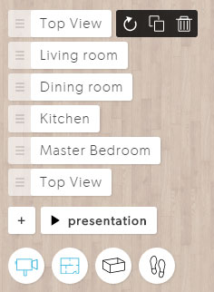
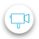
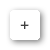
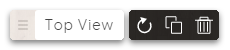
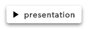

# Camera Bookmarks
With camera bookmarks Archilogic provides a tool which makes it extremely easy to create quick and engaging animations within seconds. By using camera bookmarks you can choose yourself which details of a 3d model are important and need to be showcased. Click on the full screen button to adjust the camera bookmarks of the model below.

  <iframe src="https://beta.archilogic.com/fhK6cQ?mode=view&main-menu=interior&view-menu=camera-bookmarks&presentation=loop" frameBorder="0" onmousewheel="false" allowfullscreen mozallowfullscreen webkitallowfullscreen></iframe>

## Interface

The camera bookmarks interface contains several bookmarks and additional buttons to add remove, clone or update said bookmarks.

Click on the camera button to open and close the camera bookmarks menu.

Click on the + button to add a new camera bookmark. The current position of the camera will be used to create the new bookmark.

Once you clicked on the + button a new camera bookmark shows up.

Click and drag the three stripes on the left to change the sequence of the camera bookmark.

Click on the text to edit the name of the camera bookmark.

The dark grey buttons show up once the mouse cursor hovers over a camera bookmark.

Click the curved arrow to update the camera position of the current bookmark. This will replace the stored camera position with the current location of the camera.

Click on the two squares to duplicate a camera bookmark. This is useful if you want to return to a specific camera position before moving on in the animation.

Click on the trashcan to delete the current camera bookmark.

Click the Play button to start the presentation. The camera will move between the different camera bookmarks that you set up beforehand.