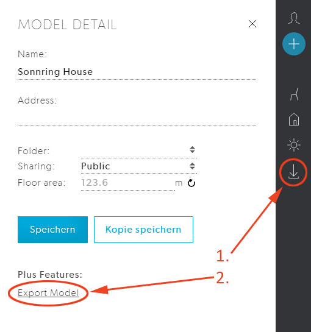
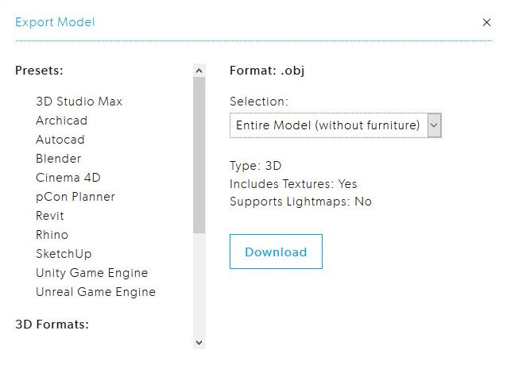

# Custom 3d data

Once you have a 3D model on Archilogic (either through using our conversion service or you by building it yourself) you can also export it out of the editor again and use it in a 3rd party 3D software.
This topic describes how to export 3d content from Archilogic and what you have to keep in mind while doing it.

## How to export 3d content

In order to export 3d content from Archilogic you need to have an Archilogic account and be logged in.
Open the the saving menu and then click on the **Export Model** button to open the Export pop up menu.

Once the Export menu is open you have the choice to either select a software you want to export to or a file format.
If you select a software the exporter automatically selects the best possible export options from a set of available options for this software.

The drop down menu above the download button gives you the choice whether you want to download the entire mode, the active level or only the selected object.
Please keep in mind that the export functionality only allows you to download the Architectural object and not the furniture pieces.
Click on the download button to download the 3d model in a .zip archive.

## Supported 3d export file formats

* .obj

* .fbx

* .blend

* .3ds

* .dxf

## Supported 2d export file formats

* .dxf
