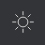
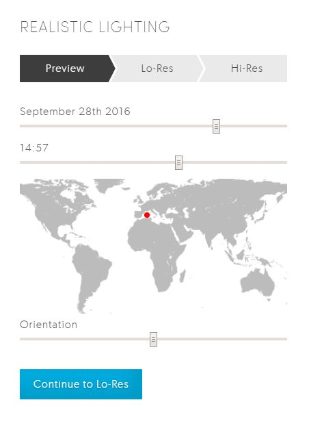
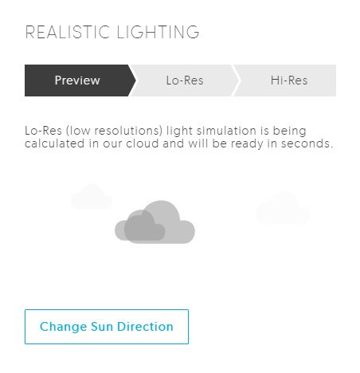
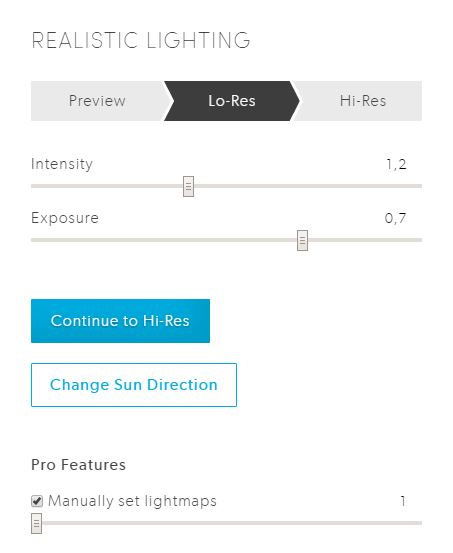
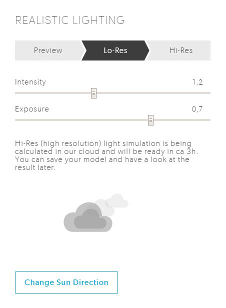
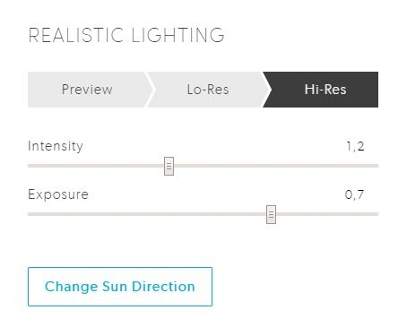

# Realistic Lighting

Lighting plays a huge role in an Archilogic model. While the real time lighting within Archilogic is good enough to let you see and recognize everything in a room, it always feels a bit off. You may not notice it immediately but the thing that is lacking is the atmosphere. A room without realistic lighting looks bland and boring as every surface receives the same amount of light.

This is why we introduced a feature to add realistic lighting to Archilogic. With realistic lighting switched on a room feels immediately more alive. Light shines through the windows and the corners of a room are suddenly darker.

You can open the realistic lighting menu by clicking on little sun icon in the main menu.

The Lighting menu looks differently depending on whether realistic lighting is active or inactive.

## Realistic Lighting is inactive

In its inactive state the menu for realistic lighting lets you adjust the position of the sun by changing the date, time, location and rotation of the model.
Once you start playing around with these handles you can see a little sun symbol moving around in the 3d viewport along with some low quality real time lighting that gives you a rough idea on how the lighting will look once its finished.
Once you're happy with the direction and angle the light comes from you can click on **Continue to Lo-Res** to create a first preview of the lighting.
The creation of the low resolution lighting should only take some seconds till it's finished. You can however save the scene after you clicked on the button and do something else as the rendering is done on one of our servers in the background and does not need the model to be open during this process.
{: .img-responsive}

## Low Resolution Lighting is active

**If realistic lighting is switched on architectural objects become static and can't be further customized!**

{: .img-responsive}

When the rendering of the preview is done you can already get a good impression on how the lighting atmosphere will look and feel like. If you're happy with your set up you can click on the **Continue to Hi-Res** button to create a high resolution version of the lighting that looks better than the low resolution one.
The creation of the high resolution lighting takes a bit longer till it's finished. You can however also save the scene after you clicked on the button and do something else as the rendering is done on one of our servers in the background and does not need the model to be open during this process.

If you want to discard the lighting or edit the Architecture you have to click on the **Change Sun Direction** button to switch off realistic lighting.

By activating the **Manually set lightmaps** checkbox you can choose to set the number of the lightmaps manually.
Basically it can be said that the more lightmaps you add to your model, the nicer the lighting will look.
The downside of a big number of lightmaps is that the model automatically takes longer to load and can perform worse on devices with a slow graphics card.
If you want to manually set the number of lightmaps you have to do it **before** you click on the **Continue to Hi-Res** button.
Usually the best practice is to leave the checkbox inactive and let our system automatically decide how many lightmaps it needs for a model.

{: .img-responsive}

## High Resolution Lighting is active

**If realistic lighting is switched on architectural objects become static and can't be further customized!**

{: .img-responsive}

The high resolution lighting is the last stage of lighting and also the one that looks the best. The menu looks more or less the same as the previous one.
You can slightly change the look and feel of the lighting atmosphere by changing the values of Intensity and Exposure.
With the *Intensity* and *Exposure* sliders you can customize how the lightmap is applied onto the 3d model.
Usually a value of 1.2 for Intensity and 0.7 for Exposure works best.

If you want to discard the lighting or edit the Architecture you have to click on the **Change Sun Direction** button to switch off realistic lighting.
